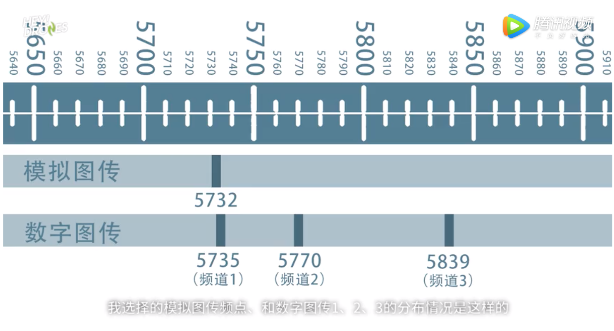
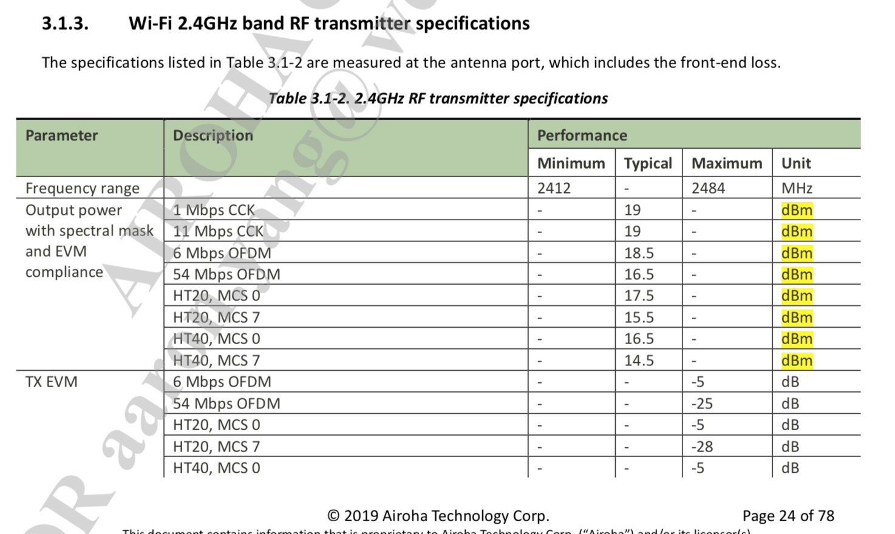

Author: 9crk
Data: 2020-03-06
Place: ShenZhen Intelli-Rocks Tech

# FPV 学习笔记
### 1.模拟还是数字？
在DJI之前，FPV都是模拟的，延时低于30ms，分辨率低，有雪花。  
DJI推出28ms数字图传，能传高清画面，市场格局变化。  

### 2.FPV用的是什么频率？
5.8G。 一般都是使用2.4G或者UHF（433等）做遥控（RC）,5.8G做图传。并非5.8G更好，5.8G穿越障碍的能力更差。但干扰少，频段多，更适合这个产业发挥。  
数字图传会严重干扰模拟图传，数字图传不会被模拟图传干扰。  
参考 https://xw.qq.com/cmsid/20190917V0OYE200  

参考：一个关于2.4G和5.8G哪个更好的帖子 https://fpvlab.com/forums/showthread.php?22857-5-8-or-2-4GHz-for-video  

### 3.发射功率是多少
普通的wifi模块的功率要看速率，比如MCS0和OFDM/CCK 功率最大，可以传输的更远，但是速率就低不少。MCS参考https://blog.csdn.net/javin_l/article/details/85163652  
不同的国家对功率的要求不一样。DJI采用700mW的5.8G图传，也就是大约28dbm，见 https://www.dji.com/cn/fpv/info#1-8   
换算：  
dbm = 10*log(P)  
例：  
30dbm = 1000mW   
AR9344最大发射功率只有25dbm 大约310mW，大约能支持2km图传  

### 4.如何使用普通wifi去做图传
开源项目:https://github.com/svpcom/wifibroadcast  
实测视频:https://www.youtube.com/watch?v=eGtF2N5qoJw  

直接通过wifi发送raw data，并且只是单向发送。  
采用前向纠错（FEC）来保障数据尽量不花掉。参考 https://baike.baidu.com/item/%E5%89%8D%E5%90%91%E7%BA%A0%E9%94%99  
常用的纠错比例是 1/2、2/3、3/4、5/6、7/8. 入7/8，就是1/8是冗余，7/8是原始数据。  
ES流：原始数据   
PES流：加入了就错码的数据   
TS流:加入了时间的纠错码的数据 被分成小块用于传输  

作者参加2019年底的的第36届混乱通信大会（36C3） 链接 https://www.youtube.com/watch?v=X8Aila0LjFo  
使用EZ-wifibroadcast 飞行60KM距离 https://www.youtube.com/watch?v=bcYOgW3WmS4  

